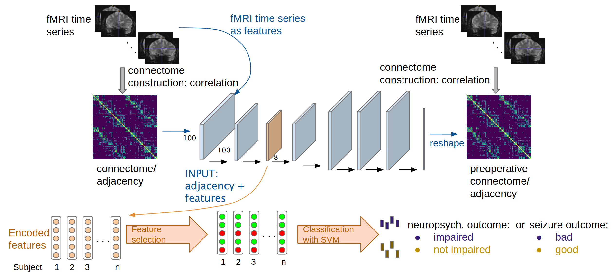

# Project description

This repository contains code of a graph-variational auto-encoder, adapted to connectivity matrices representing functional 
connectivity of the brain. The trained model can be used to extract connectivity related features which can serve as input for downstream tasks.  
More information can be found in our paper "Graph auto-encoder to identify distinct connectivity 
patterns associated with language performance after epilepsy surgery". Trained models for five different seeds and different 
cut-off values for connectivity matrices are also provided. These trained models can be applied to extract subject-specific
features (embedding) for new datasets independent of dataset size.

## HCP data
The data used to train the model is part of the 1200 subjects release of the Human Connectome Project. In
particular we used the ICA-FIX denoised dataset, which includes only 
grayordinates and already went through initial preprocessing. More information
on the release can be found [here](https://www.humanconnectome.org/study/hcp-young-adult/document/1200-subjects-data-release). 
To access some of the subject-related information (f.e. zygosity) Restricted 
Access Data Use Terms have to be accepted (See [Quick Reference: Open Access vs Restricted Data](https://www.humanconnectome.org/study/hcp-young-adult/document/quick-reference-open-access-vs-restricted-data)).
Data can be downloaded from [ConnectomeDB](https://db.humanconnectome.org/app/template/Login.vm) 
after creating a user account.

## Assumptions
It is assumed that the downloaded data is already mapped to freesurfer's 
fsavarage4 surface in mgh-format and stored in two folders corresponding to 
data download:
   - root/folder/of/HCP/data/HCP_3T_RESTA_fmri
   - root/folder/of/HCP/data/HCP_3T_RESTB_fmri.
  
We also applied bandpass filtering and global signal regression, which is also
indicated in the file name (f.e. lh.rfMRI_REST1_LR_Atlas_hp2000_clean_bpss_gsr_fs4.mgh).
  
To map from HCP-space to fsaverage4 you can follow this [manual](https://wiki.humanconnectome.org/display/PublicData/HCP+Users+FAQ#HCPUsersFAQ-9.HowdoImapdatabetweenFreeSurferandHCP?). 
It requires [Connectome Workbench](https://humanconnectome.org/software/connectome-workbench) and [Freesurfer](https://surfer.nmr.mgh.harvard.edu/fswiki/DownloadAndInstall), which can be installed
for free. The freesurfer command mris_convert is useful to convert between 
image file formats.

## Code
- settigs.py: _set paths of folder to store connectivity matrices and time-series_
- HCP_create_ts.py: _extract time_series based on Schafer 100 parcellation, 
  the parcellation can be found in the Deliveries- folder._
- correlation.py: _calculate connectivity matrices, the threshold needs to be set in the script_
- HCP_train.py: _file to train a new model_
- get_embedding.py: _use a trained auto-encoder to extract individual embeddings for subjects which can be used for a 
  downstream classification task_
  
## Deliveries
In the deliveries folder we provide files, which are needed by the scripts.

- the parcellation files Schaefer2018_Parcels_7Networks_oder.annot 
  for left and right hemisphere: _The parcellation for fsaverage5 was
  taken from [here](https://github.com/ThomasYeoLab/CBIG/tree/master/stable_projects/brain_parcellation/Schaefer2018_LocalGlobal/Parcellations/FreeSurfer5.3) and mapped through freesurfer's mri_surf2surf command to fsaverage4_
- Subjects.csv: _It contains the ID of subjects used in our paper. When running the scripts, it will be regenerated containing additional subject-related information_
- 0verticeslh.npy and 0verticesrh.npy: _vertices without MRI signal in HCP data, they are on the medial part of both hemispheres_

## TrainedModels
This folder contains trained models with different seeds and different connectome densities.
- full: all positve correlations are kept
- top50: positive correlation values above 50% -ile are kept, each correlation value is only considered once
- top90: positive correlation values above 90% -ile are kept, each correlation value is only considered once
